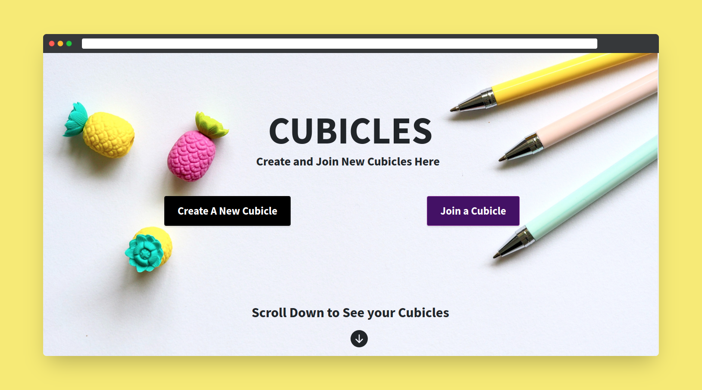

# :pizza: Quaternate

Quaternate is an app to support multidimensional collaborative environment among a group of people!

## :tada: Features

People can simultaneously have a video/audio call while texting each other, and can also doodle and draw any images (A feature to create and edit documents simultaneously is also under construction). This app is specially beneficial when you want to discuss ideas, because currently one has to switch between many apps, while this all can be done in Quaternate's cubicles with only a scroll !!

## :camera: Screenshots

## :hammer: Built With

- [Node.js](https://nodejs.org/en/)
- [Express.js](https://expressjs.com/)
- [MongoDB](https://www.mongodb.com/)
- [Bootstrap](https://getbootstrap.com/)
- [EJS](https://ejs.co/)

## Instructions To Set it Up
